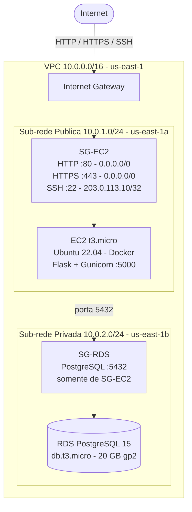

# Arquitetura AWS — ToggleMaster

## Diagrama

## Componentes

### VPC e Sub-redes

| Componente | CIDR | Zona |
|---|---|---|
| VPC | 10.0.0.0/16 | us-east-1 |
| Sub-rede Pública | 10.0.1.0/24 | us-east-1a |
| Sub-rede Privada | 10.0.2.0/24 | us-east-1b |

### Security Groups

**SG-EC2** (anexado à instância EC2):

| Direção | Protocolo | Porta | Origem |
|---|---|---|---|
| Entrada | TCP | 80 | 0.0.0.0/0 |
| Entrada | TCP | 443 | 0.0.0.0/0 |
| Entrada | TCP | 22 | `203.0.113.10/32` |
| Saída | Tudo | Tudo | 0.0.0.0/0 |

**SG-RDS** (anexado à instância RDS):

| Direção | Protocolo | Porta | Origem |
|---|---|---|---|
| Entrada | TCP | 5432 | `SG-EC2` |
| Saída | — | — | negado |

## Estimativa de Custo Mensal

| Serviço | Configuração | Preço/mês |
|---|---|---|
| EC2 | t3.micro · on-demand · 730h | $7,59 |
| RDS PostgreSQL | db.t3.micro · Single-AZ · 730h | $11,68 |
| RDS Storage | 20 GB · gp2 | $2,30 |
| EBS (EC2) | 8 GB · gp3 | $0,64 |
| Transferência de dados | ~10 GB outbound | $0,90 |
| Internet Gateway | (sem custo fixo) | $0,00 |
| **Total estimado** | | **~$23 / mês** |

> Com o **Free Tier** da AWS (12 meses): EC2 t2.micro e RDS db.t3.micro têm 750h/mês gratuitas, reduzindo o custo para ~**$3/mês** no primeiro ano (apenas storage e tráfego).
